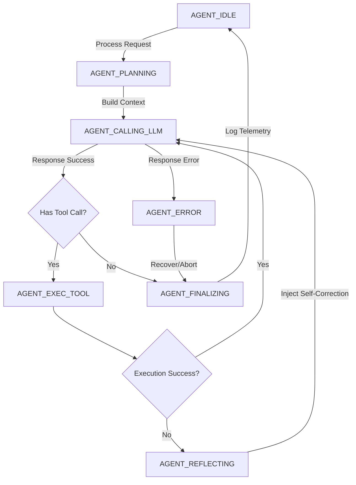

# 🏛️ FLASH AI v3.0 Technical Architecture

## 🏗️ High-Level Overview
Flash AI is a self-evolving agentic framework built entirely in the **Ring language**. It bridges high-level reasoning with low-level systems through dynamic tool registration and autonomous decision making.

The system is designed to act as a **Senior Systems Architect**, capable of understanding complex project structures, executing modifications, and creating its own tools at runtime.

Version 3.0 fundamentally changes the internal execution structure from a chaotic naive loop to a strict, mathematically deterministic **Formal Agent State Machine (FSM)** equipped with **Context Intelligence** and **Self-Healing Reflection**.

---

## 🔁 Agentic Logic Flow (The Formal State Machine)

The core strength of Flash AI v3.0 is the **Finite State Machine-driven Reasoning Loop** implemented in `AgentStateMachine` and mapped within `SmartAgent`.



---

## 🛠️ Main Subsystems (Phase 3 & Phase 4)

### 1. Agent State Machine (`agent_state_machine.ring`)
Replaces the standard algorithmic `while(True)` logic inside `sendToAI`. The core executor strictly navigates formal states, preventing infinitely looping tool behaviors and ensuring predictable transitions between reasoning, doing, and reflecting.

### 2. The Reflection Engine (`reflection_engine.ring`)
The auto-healing core. If a tool fails (e.g. "Permission Denied" or "Regex Mismatch"), it intercepts the failure. It diagnoses the issue using pattern-matching heuristics and injects a `[SELF-CORRECTION PROTOCOL]` diagnostic into the next agentic cycle.

### 3. Context Intelligence (`context_intelligence.ring`)
Moving away from simple chronological string limits, this sub-engine features an **Importance-Weighted Scorer**. It guarantees that low-level outputs (like raw log lines) decay fast, but high-priority directives (like user feedback and compilation errors) stay indefinitely in memory within the token limits constraint.

### 4. Interface Layer (`CoreAgent`)
Acts as a unified bridge between the GUI/CLI and the `SmartAgent`.
- **Language Detection:** Dynamically maps Arabic or English responses continuously.
- **Session Bridge:** Connecting front-end history to back-end logic.

### 5. AI Client & Rate Limit Manager (`ai_client.ring`)
A multi-provider client featuring:
- **Exponential Backoff:** Adaptive sleep timing (`retryWithBackoff`) resolving 429 API rate limits smoothly.
- **Robust JSON Mapping:** Handles both standard and **colon-prefixed** keys.
- **Provider Switching:** Fallback mechanism between OpenRouter, Gemini, OpenAI, and Claude.

### 6. Security Layer
- **Role-Based Authorization:** Restricts destructive tools (file write/delete) unless the user grants "Full Permission".
- **Tool Sandbox Validation:** Hard path checks against traversal attacks.

---

## 📁 File Structure

```text
/g/Flash AI/
├── gui_main.ring               # Graphical Entry Point
├── main.ring                   # CLI Entry Point
├── src/
│   ├── smart_agent.ring        # Central Coordinator
│   ├── agent_state_machine.ring# [v3.0] Deterministic FSM
│   ├── reflection_engine.ring  # [v3.0] Auto-Correction AI
│   ├── context_intelligence.ring# [v3.0] Context Weighting
│   ├── ai_client.ring          # Web & Provider Dispatch
│   └── agent_tools.ring        # Master Tool Registry
├── src/tools/                  # Isolated Tool Executables
├── custom_tools/               # Directory for AI-generated scripts
├── config/                     # Keys & Environment Configs
└── docs/
    └── architecture.md         # [Viewing Now]
```

---
**Senior Systems Architect v3.0**
*Developed with sovereign AI architecture principles.*
